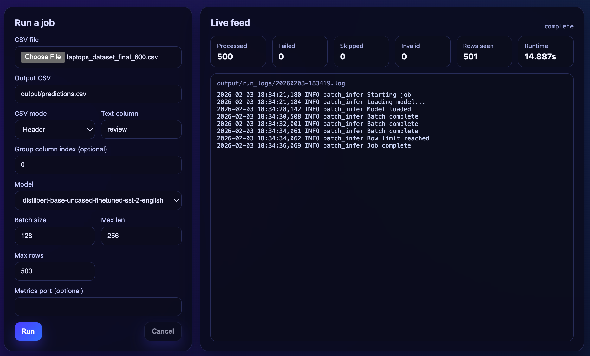
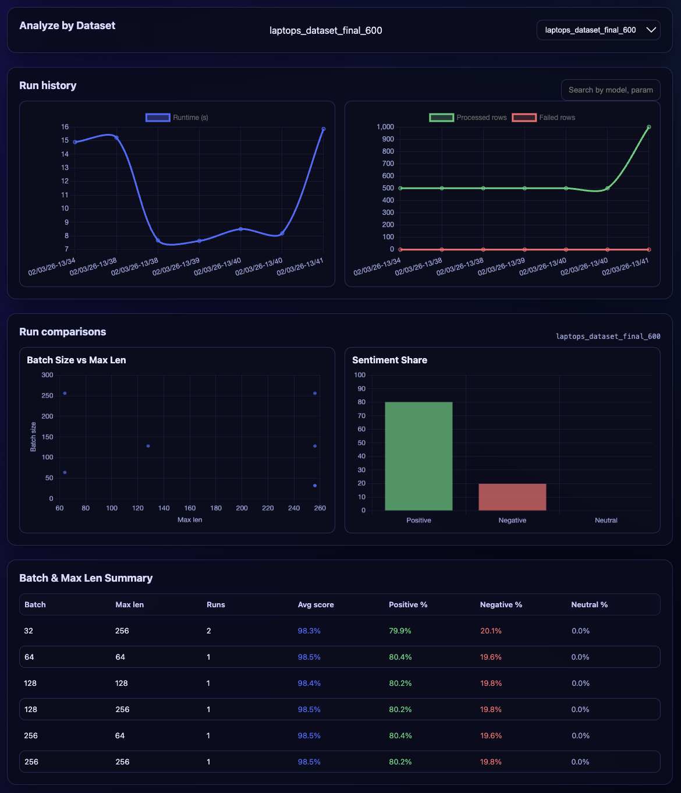
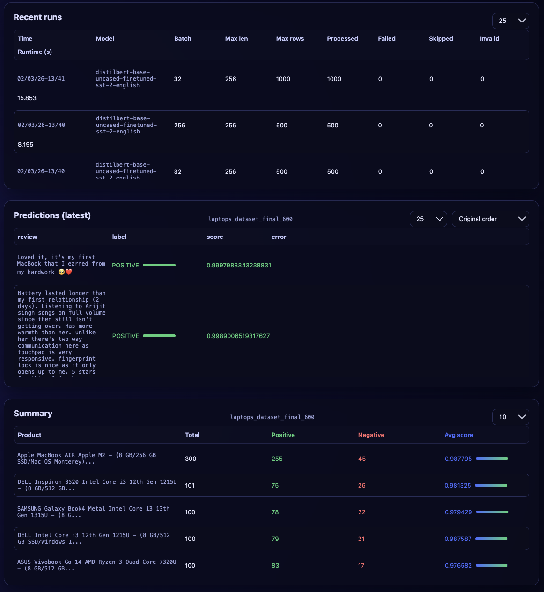

# Sentiment Batch Pipeline

Batch inference pipeline for CSV sentiment analysis with optional dashboard UI, metrics, and group summaries.

## Features
- Batch inference with tunable parameters (batch size, token length, model name, max rows, etc.)
- CSV header or headerless parsing with robust sanitization and validation
- Optional group summaries by column index
- Prometheus metrics and live JSON metrics
- Dashboard UI for uploads, runs, and analysis
- Dockerized build with CI/CD to GHCR

## How does it work?
The full application has three layers:
1. Batch pipeline (headless): reads a CSV and parameters and writes predictions, summaries, and metrics.
2. API layer: exposes the pipeline over HTTP so runs can be started, monitored, and queried.
3. UI layer (React/TypeScript): provides uploads, run controls, and visual analysis.

Full picture (end-to-end):
- Input and parameters: CSV upload or file path with settings (mode, columns, batch size, max length, max rows).
- Processing: tokenization and model inference across batches.
- Outputs (files): `output/predictions.csv`, `output/predictions_group_summary.{json|csv}`, `output/live_metrics.json`, `output/run_history.jsonl`, `output/run_logs/`.
- Serving: the API exposes run status, logs, predictions, and summaries.
- UI: dashboard starts runs, monitors progress, metrics, and visualizes results.

## Architecture at a glance
```
CSV file
  ↓
Batch pipeline (tokenize + infer)
  ↓
Outputs + live metrics  →  Dashboard API  →  Web UI
```

## Design choices
- **Explicit column selection**: No inference for text/group columns to avoid accidental misreads and keep runs predictable.
- **Header vs headerless**: Separate modes so users can pick by name or index with clear validation.
- **Batching controls**: `BATCH_SIZE`, `MAX_LEN`, and `MAX_ROWS` are configurable to balance speed and memory.
- **Observability**: Live JSON for the UI and optional Prometheus metrics for headless runs.
- **Artifacts on disk**: Outputs are written to `output/` for repeatability and easy inspection.

## What I would improve next
- **Streaming runs**: Start processing as soon as data is uploaded for faster feedback.
- **Caching**: Reuse tokenized batches or model outputs when parameters are unchanged.
- **Dataset profiling**: Auto-scan columns and suggest candidates for text/group columns.
- **Multiple concurrent jobs**: Support running and tracking multiple jobs in parallel.
- **One-click demo deploy**: Publish a hosted demo so others can try it quickly.

## How to use
### Step 1. Prerequisites
Have a dataset ready. The application has been tested with the following datasets:
- [Sentiment140 (Kaggle)](https://www.kaggle.com/datasets/kazanova/sentiment140)
- [Amazon Fine Food Reviews (Kaggle)](https://www.kaggle.com/datasets/snap/amazon-fine-food-reviews?resource=download)
- [Rotten Tomatoes Movies and Reviews (Kaggle)](https://www.kaggle.com/datasets/andrezaza/clapper-massive-rotten-tomatoes-movies-and-reviews/data)
- [Twitter Airline Sentiment (Kaggle)](https://www.kaggle.com/datasets/crowdflower/twitter-airline-sentiment)
- [Sentiment Analysis Dataset (Kaggle)](https://www.kaggle.com/datasets/abhi8923shriv/sentiment-analysis-dataset)
- [Flipkart Laptop Reviews (Kaggle)](https://www.kaggle.com/datasets/gitadityamaddali/flipkart-laptop-reviews)

Tools:
- Docker (required)
- Make (optional; bash scripts work without it)

### Step 2. Quick start
Pull the repo, run tests, and start locally:
```bash
git clone https://github.com/akutluozen/sentiment-batch-pipeline.git
cd sentiment-batch-pipeline
make test-docker
make run-full
```
Open http://localhost:8001.
Once the UI loads, you can start using the tool!

### Step 3. Run a job
Use the dashboard to upload a CSV, set parameters, and monitor progress.
Before uploading a CSV, take a minute to identify the text column you want to analyze and, if needed, the 0‑based column index you want to group results by. This is kept manual on purpose so you can quickly review the file structure before proceeding.



You can then analyze results by dataset, model, and run settings using charts and tables:

<table>
  <tr>
    <td></td>
    <td></td>
  </tr>
</table>

## Run from source
### Headless (batch inference)
```bash
make run-headless INPUT_CSV=data/test-set.csv TEXT_COL=text
```
Run the full headless example with all fields populated (uses `data/test-set.csv` and `TEXT_COL=text`):
```bash
make run-example-headless
```

### Full Dashboard (UI and API)
```bash
make run-full
```
Open http://localhost:8001

### Without Makefile (bash scripts)
```bash
./run.sh
```
Run with common overrides:
```bash
INPUT_CSV=data/test-set.csv TEXT_COL=text BATCH_SIZE=128 MAX_ROWS=500 ./run.sh headless
```
Run the dashboard:
```bash
./run.sh dashboard
```
Cleanup (Docker containers, cache, artifacts):
```bash
./cleanup.sh --all
```

## Use prebuilt containers
Pull the latest images from GHCR:
```bash
docker pull ghcr.io/akutluozen/sentiment-batch-pipeline:latest
docker pull ghcr.io/akutluozen/sentiment-batch-pipeline-dashboard:latest
```
Choose one of the options below depending on what you want to run.

### Dockerfiles (repo)
- `Dockerfile`: batch pipeline (headless)
- `Dockerfile.dashboard`: dashboard UI + API

### Run in Docker (copy/paste)
```bash
docker build -t iqrush .
docker run --rm -v "$PWD:/app" -e INPUT_CSV=/app/data/test-set.csv -e TEXT_COL=text iqrush
```

```bash
docker build -f Dockerfile.dashboard -t iqrush-dashboard .
docker run --rm -p 8001:8001 -v "$PWD/output:/output" iqrush-dashboard
```

### Full experience (both images)
Run the batch pipeline and dashboard together using Docker. Save this as `docker-compose.yml` (or `docker-compose.yaml`):
```yaml
services:
  pipeline:
    image: ghcr.io/akutluozen/sentiment-batch-pipeline:latest
    volumes:
      - ./data:/data
      - ./output:/output
    environment:
      INPUT_CSV: /data/test-set.csv
      TEXT_COL: text
      OUTPUT_CSV: /output/predictions.csv
      MAX_ROWS: 500
      BATCH_SIZE: 128
  dashboard:
    image: ghcr.io/akutluozen/sentiment-batch-pipeline-dashboard:latest
    ports:
      - "8001:8001"
    volumes:
      - ./output:/app/output
```

Then run:
```bash
docker compose up
```
Open http://localhost:8001

### Batch-only quick test
```bash
docker run --rm \
  -v "$PWD/data:/data" \
  -v "$PWD/output:/output" \
  -e INPUT_CSV=/data/test-set.csv \
  -e TEXT_COL=text \
  -e OUTPUT_CSV=/output/predictions.csv \
	-e MAX_ROWS=500 \
	-e BATCH_SIZE=128 \
  ghcr.io/akutluozen/sentiment-batch-pipeline:latest
```

### Dashboard only
```bash
docker run --rm -p 8001:8001 \
  -v "$PWD/output:/app/output" \
  ghcr.io/akutluozen/sentiment-batch-pipeline-dashboard:latest
```
Open http://localhost:8001

## Configuration
Common overrides (env vars):
- `INPUT_CSV=data/test-set.csv` (any readable file path)
- `OUTPUT_CSV=output/predictions.csv` (any writable file path)
- `RUN_HISTORY_PATH=output/run_history.jsonl` (any writable file path)
- `RUN_LIVE_PATH=output/live_metrics.json` (any writable file path)
- `CSV_MODE=header|headerless`
- `TEXT_COL=text` (any column name; used when `CSV_MODE=header`)
- `TEXT_COL_INDEX=5` (integer >= 0; required when `CSV_MODE=headerless`)
- `GROUP_COL_INDEX=1` (integer >= 0; optional)
- `MODEL_NAME=distilbert-base-uncased-finetuned-sst-2-english` (any HF model id)
- `BATCH_SIZE=32` (integer > 0)
- `MAX_LEN=256` (integer > 0)
- `MAX_ROWS=10000` (integer > 0; optional)
- `METRICS_PORT=8000` (integer 1..65535; optional)

If `METRICS_PORT` is set, the headless container exposes Prometheus metrics at `http://localhost:<METRICS_PORT>/metrics`.

Run script overrides (Docker only):
- `IMAGE_NAME=iqrush` (Docker image name for headless runs)
- `DASHBOARD_IMAGE=iqrush-dashboard` (Docker image name for dashboard runs)
- `DASHBOARD_PORT=8001` (integer 1..65535)
- `HF_CACHE_VOLUME=hf_cache` (Docker volume name for model cache)

Examples:
```bash
CSV_MODE=headerless TEXT_COL_INDEX=2 INPUT_CSV=data/test-set.csv make run-headless

GROUP_COL_INDEX=1 MAX_ROWS=500 INPUT_CSV=data/test-set.csv TEXT_COL=text make run-headless

METRICS_PORT=8000 INPUT_CSV=data/test-set.csv TEXT_COL=text make run-headless
```

Bash script equivalents:
```bash
CSV_MODE=headerless TEXT_COL_INDEX=2 INPUT_CSV=data/test-set.csv ./run.sh headless

GROUP_COL_INDEX=1 MAX_ROWS=500 INPUT_CSV=data/test-set.csv TEXT_COL=text ./run.sh headless

METRICS_PORT=8000 INPUT_CSV=data/test-set.csv TEXT_COL=text ./run.sh headless
```

## Outputs
- Predictions: `output/predictions.csv`
- Group summary: `output/predictions_group_summary.json|csv`
- Live metrics: `output/live_metrics.json`

## Tests
Run locally. Install Python dependencies first:
```bash
pip install -r requirements.txt
make test
```

Run in Docker:
```bash
make test-docker
```

## CI/CD
- CI runs tests in Docker on pushes/PRs.
- CD builds and pushes images to GHCR on `main`.

## Utilities
- `make clean-docker`   Stop/remove all Docker containers
- `make clean-cache`    Remove hf_cache Docker volume
- `make clean-artifacts` Remove output artifacts (runs, logs, uploads)
- `make clean-all`      Clean docker, cache, and artifacts

## Warnings
- Some cleanup commands (especially `make clean-artifacts`) may require elevated permissions depending on how files were created. If you see permission errors, rerun with `sudo`.
- First run can be slow because models are downloaded from Hugging Face; make sure you have enough disk space.
- Large CSVs or high `BATCH_SIZE` values can increase RAM usage; lower `BATCH_SIZE` if you hit memory limits.
- On Apple Silicon, CPU inference can be slower; try smaller models for quick tests.